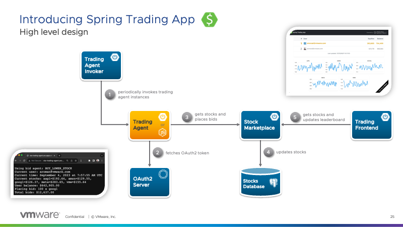
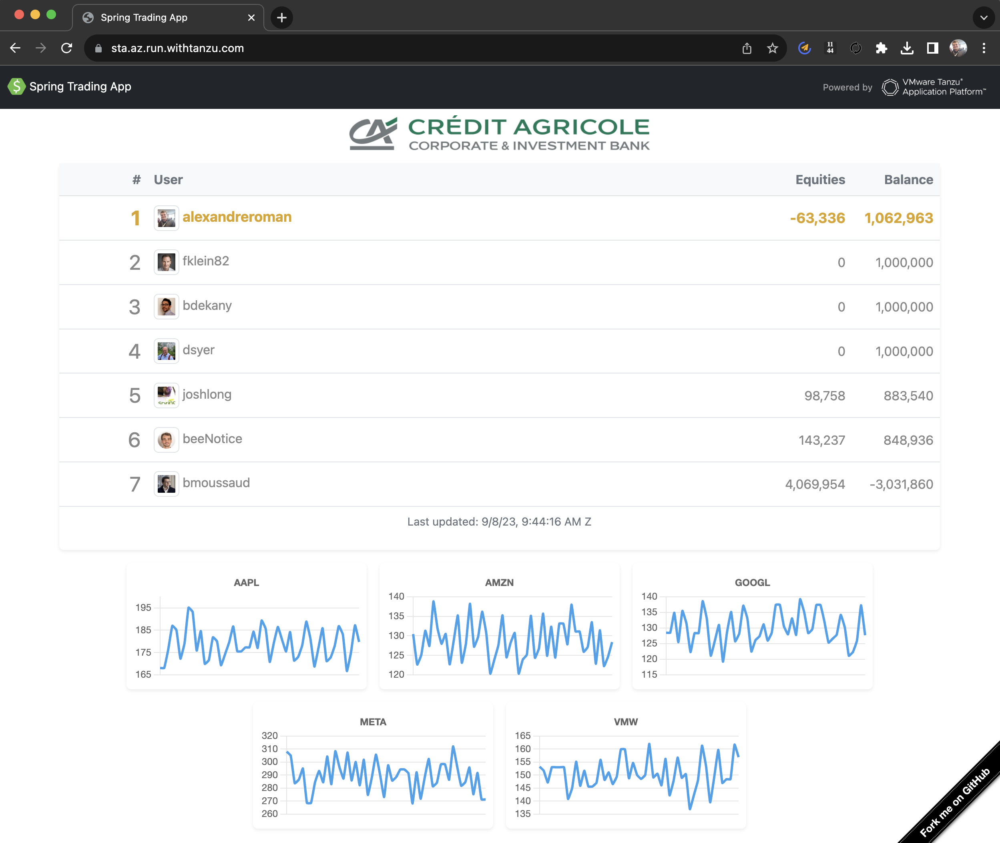
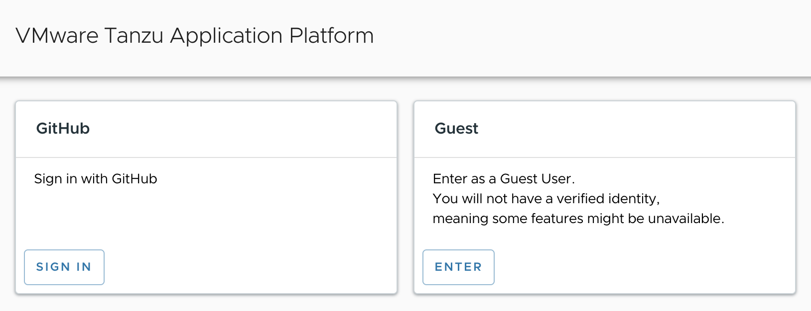
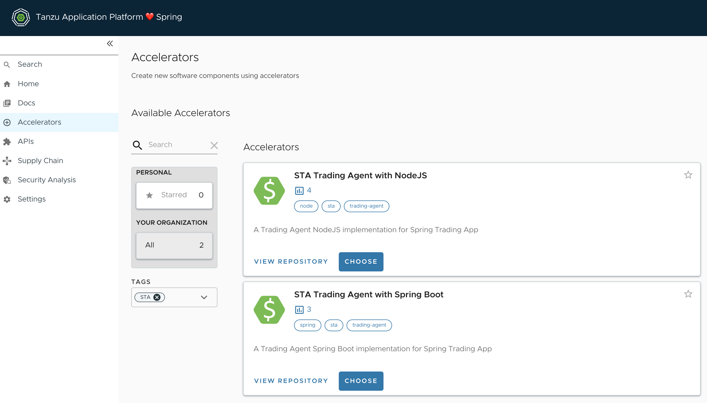
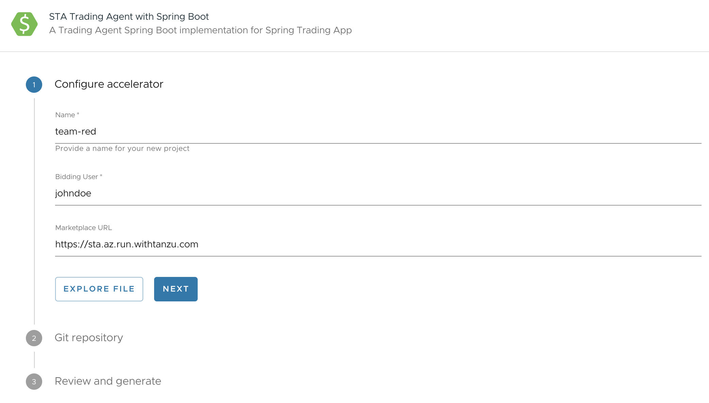
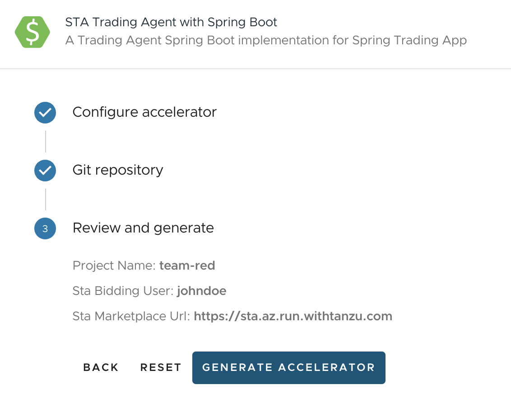
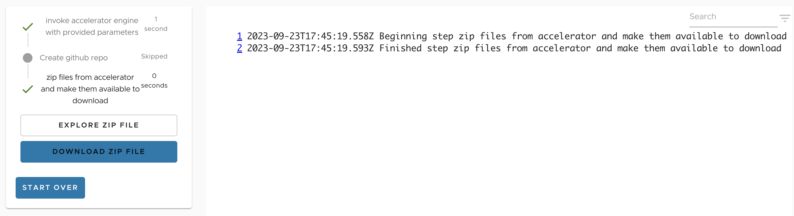
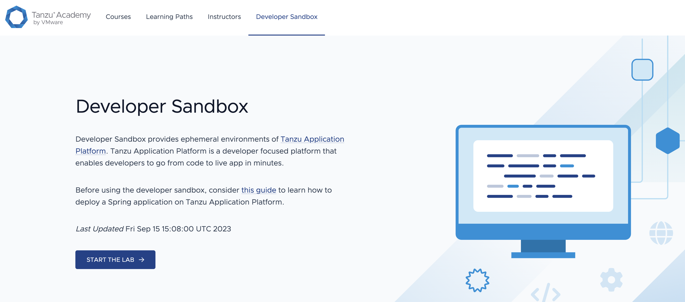

# Spring Boot(camp) at CACIB

Welcome to this Spring Boot(camp) session!

*Who said there's no Spring in Singapore?**

During this session, you're going to build and deploy your app to
a Kubernetes cluster in no time, leveraging
[VMware Tanzu Application Platform](https://tanzu.vmware.com/application-platform).

No need to craft a Dockerfile or a wall of YAML: just focus on your code
and let the platform do the work.

## How to win this game?

Your goal is to write the best algorithm for
[Spring Trading app](https://github.com/alexandreroman/sta):
you have access to
[a REST API](https://console.tap.withtanzu.com/catalog/sta/api/sta-7c3a3e88/definition),
and you will buy or sell stocks at the right time.



You need to make the most of money: a
[realtime leaderboard](https://sta.az.run.withtanzu.com) will track user balances.



If you bring a lot of money home and you rank first, you win the game!

> [!NOTE]
> You must deploy your app to Kubernetes using Tanzu Application Platform
> in order to participate in the contest.
> You can of course write / test / debug your app on your workstation.

## Prerequisites

You can use the following languages:

- Java
- NodeJS
- Go
- Python

We provide you with two templates to help you get started quickly:

- a Java / Spring Boot template,
- a NodeJS / Express template.

## How to get started?

Head over to [console.tap.withtanzu.com](https://console.tap.withtanzu.com),
and connect as a guest:



Go to the `Accelerators` section: see the menu on the left.

From this screen, you can create a new project using templates for various
languages / frameworks. Filter out this list by selecting the tag `sta`:



Let's create a Spring Boot Trading Agent:



Pick a name for your app: let's go with `team-red`.

Then pick an user for doing trading operations.
Please ask the event organizers about this user name: you will be given
your credentials.

Click next, and skip the Git repository creation for now.

You are now ready to generate your project:



Click on `Generate Accelerator`:



And voilà! Download the zip file to your workstation, unzip it and
open your favorite IDE.

Follow the instructions in `README.md` to set up your project:
you will need to enter credentials in the configuration files.

At this point you should be able to run this app on your workstation.
If you need help, please ask the event organizers!

When you are ready, proceed to the next section.

## Deploy your app to Kubernetes

You need to publish your app to a public Git repo first.

Edit the file `config/workload.yaml`, and put your Git repo public URL:

```yaml
apiVersion: carto.run/v1alpha1
kind: Workload
metadata:
  name: team-red
  labels:
    apps.tanzu.vmware.com/workload-type: web
    apps.tanzu.vmware.com/has-tests: "true"
    app.kubernetes.io/part-of: team-red
spec:
  source:
    git:
      url: https://github.com/alexandreroman/team-red.git
      ref:
        branch: main
```

Don't forget to commit and push this file!

Head over to [Tanzu Academy](https://tanzu.academy/guides/developer-sandbox)
to get your personal Tanzu Application Platform sandbox instance:



Using the sandbox terminal, run this command to download your
project source code:

```shell
git clone https://github.com/alexandreroman/team-red.git && cd team-red
```

Set up your sandbox with app credentials: you need to edit
files in `config/app-operator`.

Apply this configuration:

```shell
kubectl apply -f config/app-operator
```

You're good to go!

Run this command to build your app:

```shell
tanzu apps workload apply -f config/workload.yaml
```

Run this command to track progress:

```shell
watch tanzu apps workload get team-red
```

From now on, every time you make new commits in your Git repo,
a new build will kickstart automatically.

After a few minutes, you'll get a public URL for your app:

TODO add Knative URL
```shell
🚢 Knative Services
   NAME        READY   URL
   team-red    Ready   https://team-red-apps.tap.fqdn.com
```

Use your browser to trigger your trading agent with this public URL.

🎉 Congratulations! Your app is now live on Internet.

Please communicate your public URL to the event organizers: they will take care
of kicking off your trading agent automatically.

Now it's your turn to write the best algorithm, and try to win the game!
Good luck!

## Want more?

You can run the Spring Trading App on your workstation.

Get the [source code](https://github.com/alexandreroman/sta)
and follow instructions.

Have fun!
